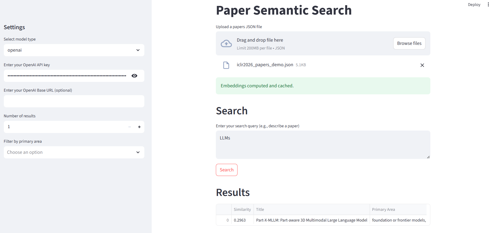

# 简体中文

# 论文语义搜索

使用语义搜索查找相似的论文。支持本地模型（免费）和 OpenAI API（质量更高）。



## 功能

- 从 OpenReview 请求论文（例如，ICLR2026 提交的论文）
- 使用示例论文或文本查询进行语义搜索
- 支持嵌入缓存
- 支持的嵌入模型：开源模型（例如，all-MiniLM-L6-v2）或 OpenAI

## 快速入门

### Web UI (推荐)

1. **准备论文**: 参照 "准备论文" 的说明下载论文数据.
2. **启动应用**:
   ```bash
   streamlit run app.py
   ```

### 作为库使用

#### 安装

对于 OpenAI 模型（需要 API 密钥）：

```bash
pip install -r requirements.txt
```

对于本地模型（免费，但安装包更大）：

```bash
pip install -r requirements.txt
pip install -r requirements-local.txt
```

#### 1. 准备论文

```python
from crawl import crawl_papers

crawl_papers(
    venue_id="ICLR.cc/2026/Conference/Submission",
    output_file="iclr2026_papers.json",
)
```

#### 2. 搜索论文

```python
from search import PaperSearcher

# 本地模型（免费）
searcher = PaperSearcher('iclr2026_papers.json', model_type='local')

# OpenAI 模型（效果更好，需要 API 密钥）
# export OPENAI_API_KEY='your-key'
# searcher = PaperSearcher('iclr2026_papers.json', model_type='openai')

searcher.compute_embeddings()

# 使用你感兴趣的示例论文进行搜索
examples = [
    {
        "title": "Part-X-MLLM: Part-aware 3D Multimodal Large Language Model",
        "abstract": "We introduce Part-X-MLLM, a native 3D multimodal large language model that unifies diverse 3D tasks by formulating them as programs in a structured, executable grammar. Given an RGB point cloud and a natural language prompt, our model autoregressively generates a single, coherent token sequence encoding part-level bounding boxes, semantic descriptions, and edit commands. This structured output serves as a versatile interface to drive downstream geometry-aware modules for part-based generation and editing. By decoupling the symbolic planning from the geometric synthesis, our approach allows any compatible geometry engine to be controlled through a single, language-native frontend. We pre-train a dual-encoder architecture to disentangle structure from semantics and instruction-tune the model on a large-scale, part-centric dataset. Experiments demonstrate that our model excels at producing high-quality, structured plans, enabling state-of-the-art performance in grounded Q&A, compositional generation, and localized editing through one unified interface."
    }
]

results = searcher.search(examples=examples, top_k=100)

# 或者使用文本查询
results = searcher.search(query="interesting topics", top_k=100)

searcher.display(results, n=10)
searcher.save(results, 'results.json')
```

## 工作原理

1.  论文标题和摘要被转换为嵌入向量
2.  嵌入向量会自动缓存
3.  你的查询将使用相同的模型进行嵌入
4.  余弦相似度用于查找最相似的论文
5.  结果按相似度得分排序

## 缓存

嵌入向量被缓存为 `cache_<filename>_<hash>_<model_name>.npy`。删除该文件以重新计算。

## 输出示例

```
================================================================================
Top 100 Results (showing 10)
================================================================================

1. [0.8456] Part-X-MLLM: Part-aware 3D Multimodal Large Language Model
   #3 | foundation or frontier models, including LLMs
   https://openreview.net/forum?id=WffiETiSeU

2. [0.8234] Large Pretraining Datasets Don't Guarantee Robustness after Fine-Tuning
   #2 | transfer learning, meta learning, and lifelong learning
   https://openreview.net/forum?id=7QjQ1mpNMX

3. [0.8199] Can Microcanonical Langevin Dynamics Leverage Mini-Batch Gradient Noise?
   #1 | probabilistic methods (Bayesian methods, variational inference, sampling, UQ, etc.)
   https://openreview.net/forum?id=h7qdCvhMdb
```

## 提示

- 使用 1-5 篇示例论文或一段你感兴趣的主题描述以获得最佳结果
- 在大多数情况下，本地模型已经足够好
- 对于关键搜索，请使用 OpenAI 模型（约 1 美元可查询 18k 次）

如果这个项目对你有用，请考虑给个 star~

## 如何引用

如果你觉得这个项目有用，请引用它：

```bibtex
@misc{SearchPaperByEmbedding,
  author = {gyj155},
  title = {Paper Semantic Search},
  year = {2025},
  publisher = {GitHub},
  journal = {GitHub repository},
  howpublished = {\url{https://github.com/gyj155/SearchPaperByEmbedding}}
}
```
